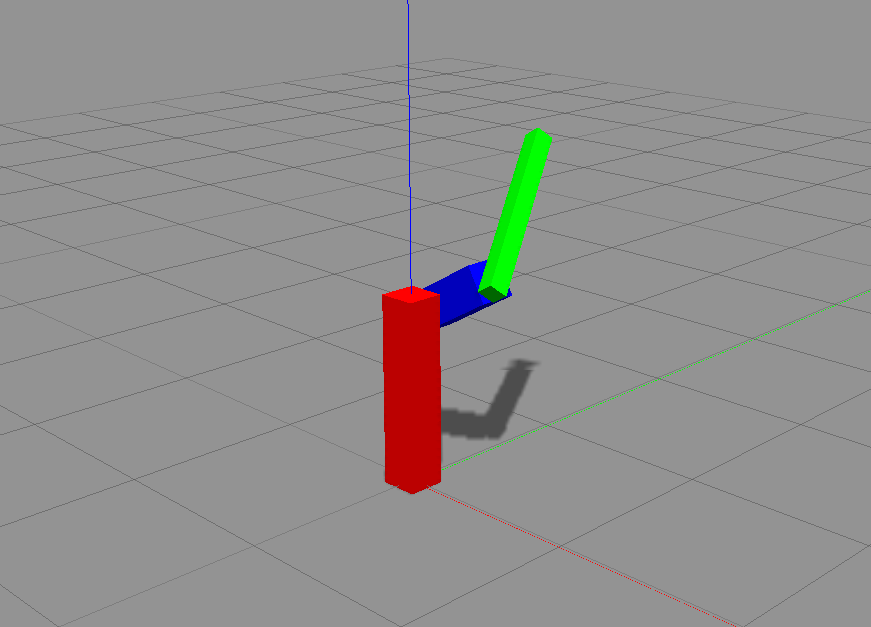

# ros_practice
Practice of ROS

## Install

```
cd ~/catkin_ws/src
git clone https://github.com/pystokes/ros_practice.git

cd ~/catkin_ws
catkin_make
```

## Sample: arm_robot

Execute following command on a terminal to start gazebo.

```
roslaunch ros_practice arm_robot.launch
```

Next, execute following command on the other terminal.

```
~/catkin_ws/src/ros_practice/src/arm_robot.py
```

You can see a simple robotic arm on gazebo like this figure.


